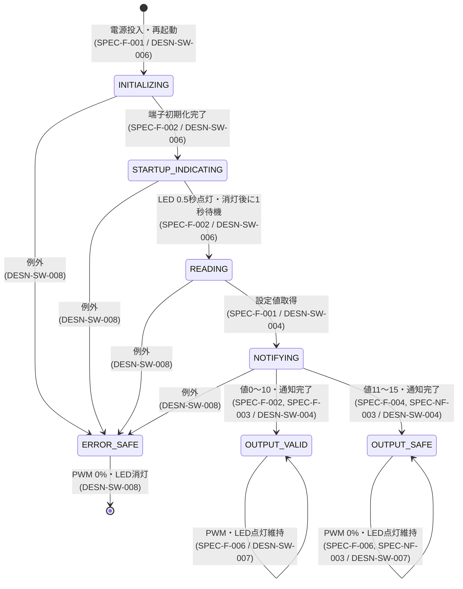

# PWM出力 設計書

## 1. 文書情報

| 項目 | 内容 |
| :--- | :--- |
| 文書バージョン | v1.0.0 |
| 文書状態 | 正式初版（基本動作の実機確認済み） |
| 上位文書 | `Specification.md` |

## 2. プロジェクト概要

Raspberry Pi Pico上で内蔵LED、4ビットのディップスイッチ入力およびPWM出力を初期化する。初期化成功後にLEDを0.5秒点灯して消灯し、1秒待機する。その後、起動時に読み取った設定値をLEDで通知し、1秒待機してから50 HzのPWMを出力する。PWM出力中はLEDを点灯状態に維持する。停止要求を受けた場合はPWMを0%にしてLEDを消灯する。設定値0～10をデューティ比0～100%へ割り当て、11～15では安全側として0%を出力する。

### 2.1 情報の分類

| 分類 | 内容 |
| :--- | :--- |
| 確定事項 | Raspberry Pi Pico、MicroPython、GP0のPWM出力、GP1～GP4のプルアップ入力、GP25の内蔵LED、初期化後のLED 0.5秒点灯・消灯および1秒待機、起動時のみの読取り、負論理、ビット重み1/2/4/8、50 Hz、10%刻み、PWM出力中のLED点灯、停止時のPWM 0%とLED消灯、LED周期0.5秒、異常値時0% |
| 制約事項 | 実装およびコメントは日本語とする。USB給電、屋内使用、最大24時間、計測機器のみ接続する試作品とする。 |
| 仮定 | USB給電元と計測機器は、それぞれの機器の定格および取扱説明に従って使用される。 |
| 設計提案 | 自動テスト可能な判定ロジックとハードウェア制御を分離する。起動スクリプトは薄く保つ。 |

## 3. ハードウェア設計

### 3.1 使用デバイス・モジュール

| 設計ID | デバイス・モジュール | 用途 | 区分 |
| :--- | :--- | :--- | :--- |
| DESN-HW-001 | Raspberry Pi Pico | 制御、入力取得、LED表示、PWM生成 | 確定 |
| DESN-HW-002 | 4極ディップスイッチ | 4ビット設定入力 | 種別は確定、型番は未定 |
| DESN-HW-003 | 内蔵LED | 初期化完了表示、設定値の回数通知、PWM出力中の点灯、停止時の消灯 | 確定 |
| DESN-HW-004 | オシロスコープ等の計測機器 | GP0の50 Hz信号を確認 | モータ等の負荷は接続しない |
| DESN-HW-005 | USB電源 | Raspberry Pi Picoへの給電 | 電池および充電回路は使用しない |

### 3.2 接続方針

- ディップスイッチの各極は、対応する入力端子とGNDの間に接続する。
- 入力は内部プルアップを使用し、ONをLow、OFFをHighとして読み取る。
- GP0は3.3 V系のデジタルPWM信号出力とし、オシロスコープ等の計測機器だけを接続する。
- USB端子から給電する。試作品のため追加の過電圧、過電流および逆接保護回路は設けない。
- 詳細なピン配置と未使用インターフェースは `interface_HW.md` に定義する。

## 4. ソフトウェア設計

### 4.1 開発環境

| 設計ID | 項目 | 採用内容 | 区分・理由 |
| :--- | :--- | :--- | :--- |
| DESN-SW-001 | 言語・実行環境 | MicroPython | ユーザー指定。Raspberry Pi Pico対応版を使用し、版は固定しない。 |
| DESN-SW-002 | 構成方式 | OSなしの単一制御フロー | 処理が起動時通知とPWM維持だけであり、並行タスクを必要としないため。 |
| DESN-SW-009 | 試作運用 | Watchdog、永続ログ、保守機能を使用しない | 動作確認を目的とする試作品であるため。 |

### 4.2 コード構成

| 設計ID | ファイル | 主要責務 |
| :--- | :--- | :--- |
| DESN-SW-003 | `main.py` | 自動起動、端子初期化、処理順序の制御、最終フェイルセーフ |
| DESN-SW-004 | `pwm_controller.py` | 4ビット値の算出、デューティ比判定、LED通知、PWM設定 |
| DESN-SW-005 | `tests/test_pwm_controller.py`、`tests/test_main.py` | ハードウェア非依存ロジックと起動シーケンスの自動単体テスト |

主要関数の設計案を次に示す。シグネチャの詳細は `interface_SW.md` に定義する。

| 関数 | 責務 | 関連設計ID |
| :--- | :--- | :--- |
| `read_switch_value` | 4入力を1回ずつ読み、負論理で0～15へ変換する | DESN-SW-004 |
| `duty_percent_for` | 0～10を0～100%へ変換し、11～15を0%へ変換する | DESN-SW-004 |
| `blink_value` | 値と同じ回数、0.25秒点灯・0.25秒消灯する | DESN-SW-004 |
| `apply_pwm` | 周波数50 Hzとデューティ比をPWMへ設定する | DESN-SW-004 |
| `run` | 初期化、起動表示、読取り、通知、出力、LED点灯、停止時の安全停止を実行する | DESN-SW-003 |

### 4.3 値の変換

入力端子をGP1、GP2、GP3、GP4の順に $p_0, p_1, p_2, p_3$ とし、ONを1、OFFを0へ正規化する。設定値 $v$ は次式で求める。

$$
v = p_0 + 2p_1 + 4p_2 + 8p_3
$$

デューティ比 $d$ は次のとおりとする。$d = 100$ はPWMの16ビット端点値を使用せず、GP0を通常GPIO出力のHighに設定する。

$$
d = \begin{cases}
10v & (0 \leq v \leq 10) \\
0 & (11 \leq v \leq 15)
\end{cases}
$$

MicroPythonの16ビットデューティ値 $u$ は、端点を含めて次式で算出する設計提案とする。

$$
u = \operatorname{round}\left(65535 \times \frac{d}{100}\right)
$$

### 4.4 処理タイミングと優先度

| 設計ID | 処理 | タイミング | 優先度 |
| :--- | :--- | :--- | :--- |
| DESN-SW-006 | 起動シーケンス | 電源投入またはソフトリセット後に1回。初期化成功後にLEDを0.5秒点灯して消灯し、1秒待機する | 単一フローのため優先度設定なし |
| DESN-SW-007 | PWM生成 | LED通知完了後に1秒待機してからPWMを設定してLEDを点灯し、ハードウェアPWMで50 Hzを継続生成する。停止時はPWMを0%にしてLEDを消灯する | ハードウェア周辺回路が生成 |
| DESN-SW-008 | 例外時停止 | 未処理例外を捕捉した場合 | 出力を0%にしてLEDを消灯する最優先の安全処理 |

起動表示の待機はLEDの初期化完了を利用者へ示すためのものであり、入力安定待ち時間ではない。起動表示の待機後に各入力を1回読み取る。チャタリング除去および複数回一致確認は行わない。

### 4.5 プロセスのライフサイクル

1. **初期処理（Initialization）**: LED出力、4個のプルアップ入力、PWM出力を初期化する。PWMは初期化時に0%とする。初期化成功後にLEDを0.5秒点灯して消灯し、1秒待機する。（DESN-SW-003、DESN-SW-006）
2. **定期処理（Periodic tasks）**: 起動表示の待機後に設定値を1回読み取り、LEDで通知する。通知完了後に1秒待機してからPWMを設定してLEDを点灯する。実行スクリプトはPWMオブジェクトを保持する待機ループを継続し、ハードウェアPWMを50 Hzで継続動作させる。連続運転は最大24時間とする。（DESN-SW-002、DESN-SW-007）
3. **割込処理（Interrupts）**: ユーザー実装の割込処理は設けない。入力はポーリングで起動時に1回だけ取得する。（DESN-SW-002、DESN-SW-004）
4. **終了処理（Termination）**: 通常終了操作は設けない。開発時の中断または例外終了時はPWMを0%とし、LEDを消灯する。（DESN-SW-008）
5. **異常処理（Error handling/Failsafe）**: 設定値11～15は仕様どおり通知後に0%を維持する。その他の未処理例外では可能な範囲でPWMを0%とし、例外を再送出してREPLへ通知する。（DESN-SW-008）

### 4.6 状態遷移

電源断はソフトウェアで検出・処理できる保証がないため、任意の状態から非同期に終了する。（SPEC-NF-004）

### 4.7 ソフトウェアインターフェース

Module間API、データ構造、イベント、コールバックおよびTask間通信方式は `interface_SW.md` に定義する。

## 5. 開発・ビルド・生成・変換ツール

| 種別 | 採用または方針 | 区分 |
| :--- | :--- | :--- |
| Compiler | 個別コンパイルなし。MicroPython VMがソースを実行する。 | 確定 |
| Build system | 専用ビルドなし。ファイル転送を配置工程とする。 | 設計提案 |
| Flash tool | MicroPython UF2の書込み、および`mpremote`によるファイル転送 | 確定 |
| Debugger | USBシリアルREPL、VS Code MicroPico拡張 | 現行環境に基づく設計提案 |
| Programmer | BOOTSELによるUSBマスストレージ書込み | 設計提案 |
| Code generator | 使用しない | 対象なし |
| 音声変換 | 使用しない | 対象なし |
| 画像変換 | 使用しない | 対象なし |
| 設定生成 | 使用しない。設定はディップスイッチから取得する。 | 対象なし |
| 静的解析 | Ruffによるホスト側解析 | テスト環境として採用 |
| Formatter | Ruff format | テスト環境として採用 |
| Unit Test framework | pytest。ハードウェアAPIはテストダブルへ置換する。 | テスト環境として採用 |

試作品では各ツールの版を固定しない。実施時の版はテスト結果のTest Environmentへ記録する。

## 6. 設計判断と理由

- 入力は起動時にのみ取得するため、割込や常時ポーリングを採用しない。
- 起動時の1回読取りであるため、待ち時間、チャタリング除去および複数回一致確認を採用しない。
- PWMはソフトウェアループではなくハードウェアPWMを使用し、LED通知後も安定した50 Hz出力を維持する。
- 入力変換とデューティ判定を分離し、実機なしで全入力値と分岐を自動検証できるようにする。
- 例外時は出力を0%へ戻し、接続先へ意図しないパルスを出し続けない。
- 試作品の動作確認を優先し、Watchdog、永続ログ、保守機能および追加の電気保護回路を実装しない。
